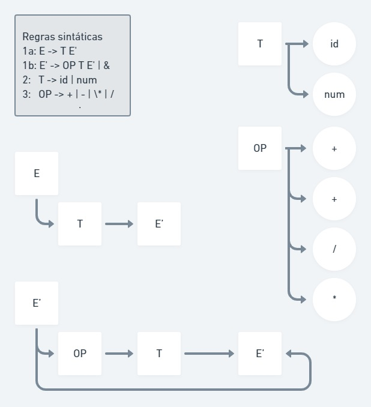

# Gramatica

## G = (Vn, Vt, P, S)

Vn = E, T, OP

Vt = id, num, +, -, \*, /

P = Dado pela regras sintática abaixo:

- _1_: E -> E OP T | T
- _2_: T -> id | num
- _3_: OP -> + | - | \* | /

Reescrevemos a regra 1 para tirar a recursão a esquerda, gerando novas regras sintáticas:

- _1a_: E -> T E'
- _1b_: E' -> OP T E' | &
- _2_: T -> id | num
- _3_: OP -> + | - | \* | /

