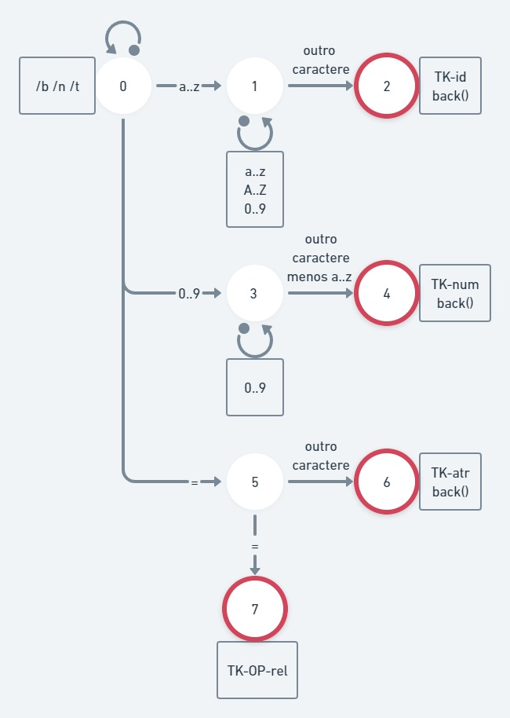

# Identificadores

- `(a..z)(A..Z|0..9|a..z)*` _começa com minúscula seguida de qualquer outro caractere selecionado no 2° grupo_

# Números

- `(0..9)+` _começa com um dígito com uma ou mais repetições_

# Pontuação

- `;`

# Operadores relacionais

- `== | >= | <= | > | < | !=`

# Operadores de atribuição

- `=`

<!-- # Palavras reservadas -->

## Glossário

- `a..z` -> intervalo de **a** até **z**
- `A..Z` -> intervalo de **A** até **Z**
- `0..9` -> intervalo de **0** até **9**
- `*` -> 0 ou mais repetições
- `+` -> 1 ou mais repetições
- `&` -> vazio

